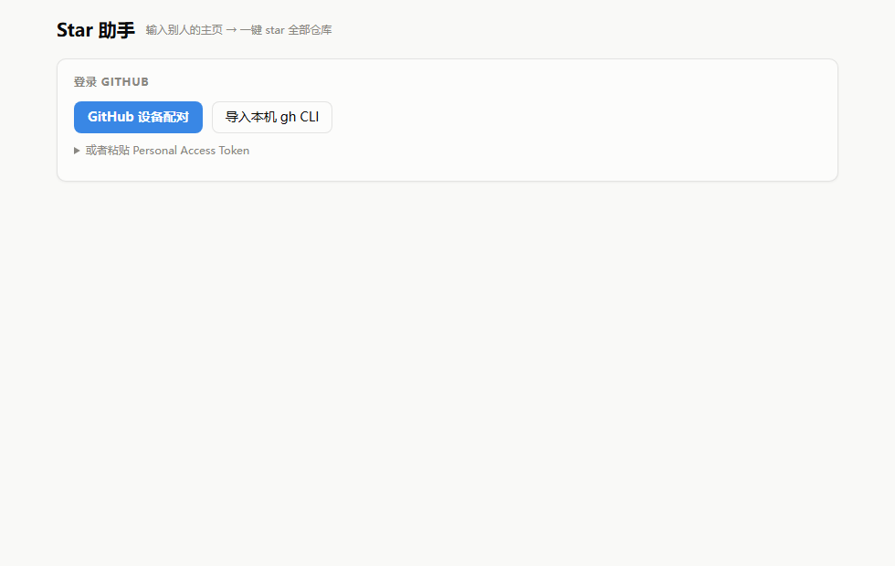
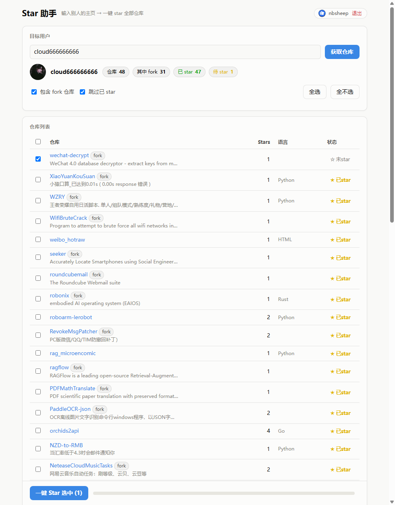

# Star 助手

一个 Windows 桌面小工具：**登录自己的 GitHub 账号，输入任意用户的主页地址，一键 Star 对方的全部仓库。**

纯 Python 标准库实现（零第三方依赖），本地运行，界面为 Edge 独立窗口。





## 功能特性

- **三种登录方式**，无需手动管理 Token：
  - GitHub 设备配对码（浏览器输入配对码即可）
  - 一键导入本机已登录的 gh CLI 凭据
  - 粘贴 Personal Access Token
- **智能地址解析**：完整主页链接（`https://github.com/xxx?tab=repositories`）或纯用户名都能识别
- **仓库列表一目了然**：名称、描述、Stars 数、语言、是否 fork，以及你当前的 star 状态
- **一键 Star**：勾选后批量 star，带逐仓库进度条和成功/失败统计
- **灵活筛选**：跳过 fork 仓库、跳过已 star 的仓库、全选/全不选
- **单个切换**：每个仓库可单独 star / 取消 star
- **凭据安全**：Token 经 Windows DPAPI 加密后存放在本机，与当前 Windows 用户绑定
- **网络健壮**：GitHub 直连被重置时，自动回退到本机常见代理端口（7897 / 7890 / 10809 / 1080）

## 环境要求

- Windows 10/11（macOS / Linux 也可运行 `python3 server.py`，但凭据为明文存储、无 Edge 窗口）
- Python 3.8+（无需安装任何第三方包）
- 可选：本机 gh CLI（仅"导入 gh CLI"登录方式需要）
- 可选：本地代理（仅 GitHub 直连不通时需要）

## 快速开始

1. 双击仓库根目录的 **`启动面板.bat`**
2. 首次使用在弹出的窗口中登录（推荐"导入本机 gh CLI"，装了 gh 并 `gh auth login` 过的用户零输入）
3. 在"目标用户"输入框粘贴别人的主页地址，例如：
   ```
   https://github.com/cloud666666666?tab=repositories
   ```
   或直接输入用户名 `cloud666666666`
4. 点击 **获取仓库**，确认列表后点击左下角 **一键 Star 选中**，坐等进度条走完

## 登录方式说明

| 方式 | 操作 | 适合人群 |
|------|------|----------|
| 设备配对 | 点按钮 → 浏览器打开 github.com/login/device → 输入 8 位配对码 | 所有人（最通用） |
| 导入 gh CLI | 点一下按钮即可 | 本机装了 GitHub CLI 并已登录 |
| 粘贴 PAT | 展开输入框粘贴 Token | 有现成 Token 的用户 |

面板申请的 OAuth scope 为 `repo`（设备配对走 GitHub CLI 的公开 OAuth App）。使用粘贴 PAT 方式时，Token 勾选 star 相关权限即可，无需 workflow 等更高权限。

## 数据安全

- Token 使用 **Windows DPAPI**（PowerShell SecureString 通道）加密，密文存放于
  `%LOCALAPPDATA%\StarAssistant\credential.bin`，只有当前 Windows 用户能解密
- 所有 GitHub 请求由本机服务直接发出，**不经过任何第三方服务器**
- 代码零第三方依赖，全部为 Python 标准库，可自行审计（两个文件：`server.py` + `index.html`）

## 工作原理

```
启动面板.bat
   └─> pythonw dashboard/server.py        # 本机 HTTP 服务 127.0.0.1:8631
         ├─ /api/auth/*                   # 设备配对 / gh 导入 / PAT 登录
         ├─ /api/target?owner=xxx         # 拉取目标用户仓库 + 自己的 starred 对照
         ├─ /api/star                     # 单仓库 star / unstar
         └─ Edge --app 独立窗口           # index.html 单页界面
```

- 仓库列表：`GET /users/{owner}/repos` 自动翻页（最多 2000 个）
- star 状态：对照 `GET /user/starred` 全量分页结果（进程内缓存 2 分钟）
- star 操作：`PUT /user/starred/{owner}/{repo}`，幂等，重复 star 无副作用

## 常见问题

**Q: 为什么刚 star 完，列表里还显示"未star"？**
GitHub 的 starred 列表 API 有几分钟缓存延迟，属正常现象，稍后刷新即可。重复 star 幂等无害。

**Q: 提示网络错误？**
大概率是直连 GitHub 的 TLS 握手被重置。面板会自动尝试 7897 / 7890 / 10809 / 1080 这几个本地代理端口；确保 Clash 等代理在跑，或换成其中一个在用的端口。

**Q: 批量 star 会不会被封号？**
面板每次 star 之间间隔 150ms，速度温和。批量 star 属于正常的公开 API 使用，但请勿短时间内对成百上千个用户狂点，尊重他人也保护自己。

**Q: 想取消 star 怎么办？**
点击仓库行右侧的"★ 已star"按钮即可单独取消。

## 免责声明

本项目仅供个人学习和正常的 GitHub 社交协作使用，请勿用于刷 star、恶意关注等滥用场景，由此产生的账号风险自负。

## License

MIT
